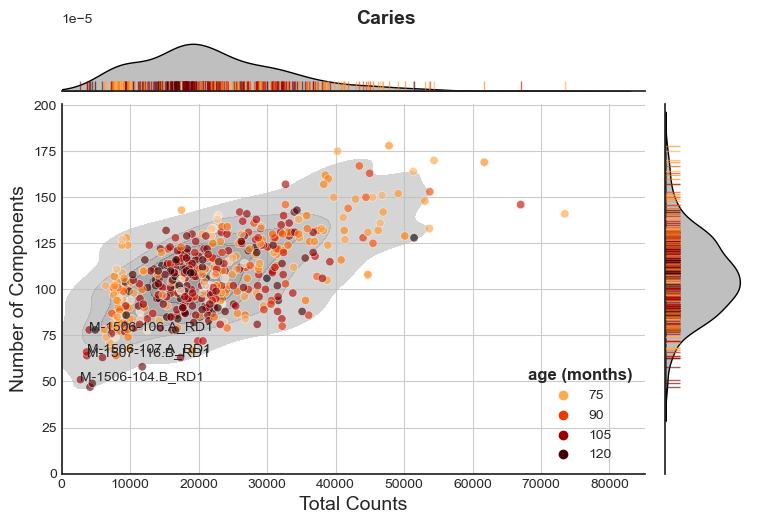
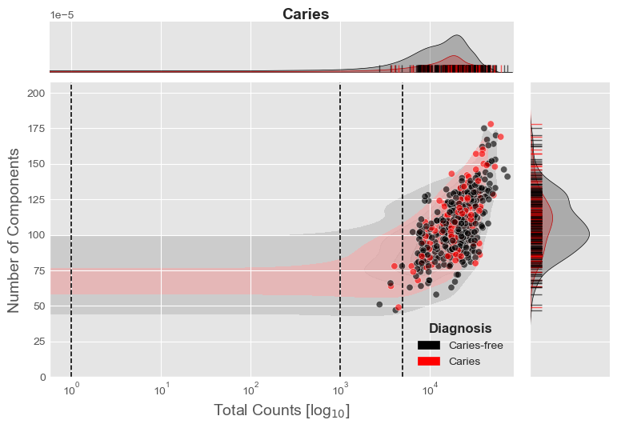
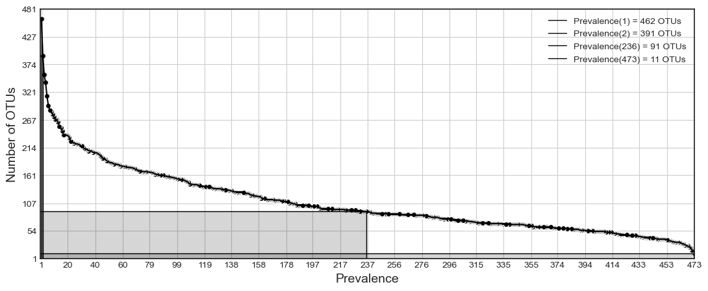
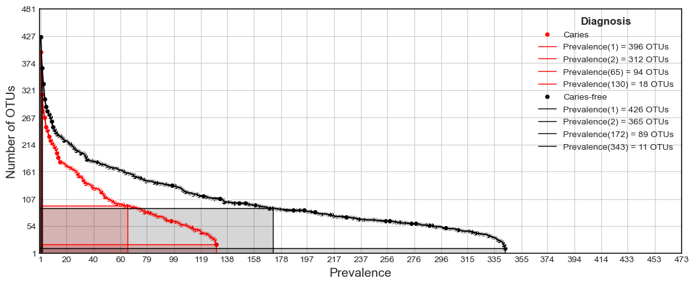

### compositional
Compositional data analysis in Python.

This package is meant to extend the methods of [scikit-bio](http://scikit-bio.org/docs/latest/generated/skbio.stats.composition.html#module-skbio.stats.composition) and serve as a pythonic alternative (not replacement) to *some* functionalities within [propr](https://github.com/tpq/propr).  

#### Dependencies:
Compatible for Python 3.


**Required:**

* pandas
* numpy
* scipy

**Optional:**

* scikit-bio
* gneiss
* ete[2/3]
* matplotlib
* seaborn
* scitkit-learn


#### Install:
```
# Stable release (Preferred)
pip install compositional

# Developmental release
pip install git+https://github.com/jolespin/compositional
```

#### Proportionality and partial correlation methods adapted from the following source:
* [propr: An R package to calculate proportionality between vectors of compositional data
 (Thomas Quinn)](https://github.com/tpq/propr)
 
#### Isometric log-ratio methods use the following sources:
* [scikit-bio: A package providing data structures, algorithms and educational resources for bioinformatics](https://github.com/biocore/scikit-bio)
* [gneiss: a compositional data analysis toolbox designed for analyzing high dimensional proportions (Jamie Morton)](https://github.com/biocore/gneiss)

 
#### Citations (Code):

	* Jin, S., Notredame, C. and Erb, I., 2022. Compositional 
	Covariance Shrinkage and Regularised Partial Correlations. 
	arXiv preprint arXiv:2212.00496.
   
   * Quinn T, Richardson MF, Lovell D, Crowley T (2017) propr: An
   R-package for Identifying Proportionally Abundant Features Using
   Compositional Data Analysis. Scientific Reports 7(16252):
   doi:10.1038/s41598-017-16520-0

   * Espinoza JL. compositional: Compositional data analysis in Python (2020). 
   https://github.com/jolespin/compositional
   
#### Citations (Theory):

	* Jin, S., Notredame, C. and Erb, I., 2022. Compositional 
	Covariance Shrinkage and Regularised Partial Correlations. 
	arXiv preprint arXiv:2212.00496.
	
	* Erb, I., 2020. Partial correlations in compositional data analysis. 
	Applied Computing and Geosciences, 6, p.100026.
	
   * Quinn TP, Erb I, Gloor G, Notredame C, Richardson MF, Crowley TM
   (2019) A field guide for the compositional analysis of any-omics
   data. GigaScience 8(9). doi:10.1093/gigascience/giz107
 
   * Quinn T, Erb I, Richardson MF, Crowley T (2018) Understanding
   sequencing data as compositions: an outlook and review.
   Bioinformatics 34(16): doi:10.1093/bioinformatics/bty175
 
   * Erb I, Quinn T, Lovell D, Notredame C (2017) Differential
   Proportionality - A Normalization-Free Approach To Differential
   Gene Expression. Proceedings of CoDaWork 2017, The 7th
   Compositional Data Analysis Workshop; available under bioRxiv
   134536: doi:10.1101/134536
 
   * Erb I, Notredame C (2016) How should we measure proportionality
   on relative gene expression data? Theory in Biosciences 135(1):
   doi:10.1007/s12064-015-0220-8
 
   * Lovell D, Pawlowsky-Glahn V, Egozcue JJ, Marguerat S, Bahler J
   (2015) Proportionality: A Valid Alternative to Correlation for
   Relative Data. PLoS Computational Biology 11(3):
   doi:10.1371/journal.pcbi.1004075
   
   * Morton, J.T., Sanders, J., Quinn, R.A., McDonald, D., Gonzalez, A., Vázquez‐Baeza, Y., et al . (2017) Balance trees reveal microbial niche differentiation. mSystems: e00162‐16. doi: 10.1128/mSystems.00162-16


#### Citations (Debut):
   
   * Espinoza JL., Shah N, Singh S, Nelson KE., Dupont CL. Applications of weighted association networks applied to compositional data in biology. https://doi.org/10.1111/1462-2920.15091


_________________________
### Usage:

Each function operates on either 2D `pd.DataFrame` or `np.array` objects and output either `pandas` or `numpy` objects, respectively.  

Transformation functions (e.g., `transform_clr`) output the equivalent object with the same shape.

Pairwise functions either output a redundant form or non-redundant form.  If a `numpy` object is input, then either a 2D redundant form or 1D non-redundant form `np.array` object will be output.  If a `pd.DataFrame` is input then there are 2 types of output that can be returned.  If `redundant_form=True`, then a square `pd.DataFrame` will be returned.  If `redundant_form=False`, then a `pd.Series` will be returned and the index will contain `frozenset` objects that have the combinations. 

For the operations in logspace, a pseudocount of 1 is added to avoid -inf values for log(0). 

#### Loading package and obtaining data
For usage, we are going to load data from oral microbiome 16S amplicon data from [Gomez and Espinoza et al. 2017](https://pubmed.ncbi.nlm.nih.gov/28910633/).

```python
import compositional as coda
import pandas as pd

# Load abundances (Gomez and Espinoza et al. 2017)
X = pd.read_csv("https://github.com/jolespin/projects/raw/main/supragingival_plaque_microbiome/16S_amplicons/Data/X.tsv.gz", 
                sep="\t",
                index_col=0,
                compression="gzip",
)

# Load metadata
Y = pd.read_csv("https://github.com/jolespin/projects/raw/main/supragingival_plaque_microbiome/16S_amplicons/Data/Y.tsv.gz", 
                sep="\t",
                index_col=0,
                compression="gzip",
).loc[X.index]


# print("X.shape: (n={} samples, m={} OTUs)")
# X.shape: (n=473 samples, m=481 OTUs)

# Classes
classes = pd.Series(((Y["Caries_enamel"] == "YES").astype(int) + (Y["Caries_dentine"] == "YES").astype(int)).map(lambda x: {True:"Caries", False:"Caries-free"}[x > 0]), name="Diagnosis")

class_colors = {"Caries-free":"black", "Caries":"red"}
```

#### (Highpass) Filtering of compositional data
Filtering functions to preprocess data.  Example use case: (1) Remove all samples with less than 10,000 total counts; (2) then all features that aren't in at least 50% of the samples, and then (3) samples that don't have at least 50 detected components.

```
X_filtered = coda.filter_data_highpass(
    X=X, 
    minimum_total_counts=10000,
    minimum_prevalence=0.5,
    minimum_components=50,
)

X.shape, X_filtered.shape
# ((473, 481), (401, 93))
```

#### Summary metrics
Summary metrics for compositional data. 

```
# Sparsity
s = coda.sparsity(X)
print("Ratio of zeros in dataset: {:.3f}".format(s))
# Ratio of zeros in dataset: 0.776

# Total number of components per composition (i.e., richness)
coda.number_of_components(X).head()
# S-1409-45.B_RD1     111
# 1104.2_RD1           84
# S-1409-42.B_RD1     142
# 1073.1_RD1          101
# A-1504-100.B_RD1     95

# Prevalence of components across compositions
coda.prevalence_of_components(X).head()
# Otu000514    470
# Otu000001    473
# Otu000038    472
# Otu000003    473
# Otu000326    432
```

#### Pairwise operations

All pairwise operations support either a redundant form or non-redundant form using the `redundant_form` argument. 

##### Pairwise sample operations:

```
# Pairwise Aitchison distance (redundant form)
aitchison_distances = coda.pairwise_aitchison_distance(X + 1, redundant_form=True)
# print(aitchison_distances.iloc[:4,:4])
#                  S-1409-45.B_RD1  1104.2_RD1  S-1409-42.B_RD1  1073.1_RD1
# S-1409-45.B_RD1         0.000000   25.384218        21.573635   23.455055
# 1104.2_RD1             25.384218    0.000000        27.811292   21.942080
# S-1409-42.B_RD1        21.573635   27.811292         0.000000   26.734435
# 1073.1_RD1             23.455055   21.942080        26.734435    0.000000

# Pairwise Aitchison distance (non-redundant form)
aitchison_distances = coda.pairwise_aitchison_distance(X + 1, redundant_form=False)
# print(aitchison_distances)
# aitchison_distance
# (S-1409-45.B_RD1, 1104.2_RD1)          25.384218
# (S-1409-45.B_RD1, S-1409-42.B_RD1)     21.573635
# (S-1409-45.B_RD1, 1073.1_RD1)          23.455055
# (S-1409-45.B_RD1, A-1504-100.B_RD1)    21.330042
# (S-1409-45.B_RD1, 2053.2_RD1)          22.531754
#                                          ...    
# (S-1410-40.B_RD1, M-1507-132.A_RD1)    23.247654
# (M-1507-132.A_RD1, C-1504-92.B_RD1)    20.422768
# (S-1410-40.B_RD1, 2005.1_RD1)          22.294198
# (2005.1_RD1, C-1504-92.B_RD1)          21.323598
# (S-1410-40.B_RD1, C-1504-92.B_RD1)     21.073093
# Length: 111628, dtype: float64
```

##### Pairwise component operations:

```
# Pairwise variance log-ratio
vlr = coda.pairwise_vlr(X + 1)
# print(vlr.iloc[:4,:4])
#            Otu000514  Otu000001  Otu000038  Otu000003
# Otu000514   0.000000   0.764679   1.844322   1.869921
# Otu000001   0.764679   0.000000   1.299599   1.230553
# Otu000038   1.844322   1.299599   0.000000   2.207001
# Otu000003   1.869921   1.230553   2.207001   0.000000

# Pairwise rho from Erb et al. 2016
rhos = coda.pairwise_rho(X + 1)
# print(rhos.iloc[:4,:4])
#            Otu000514  Otu000001  Otu000038  Otu000003
# Otu000514   1.000000   0.708325   0.304007   0.298552
# Otu000001   0.708325   1.000000   0.355895   0.394880
# Otu000038   0.304007   0.355895   1.000000  -0.070423
# Otu000003   0.298552   0.394880  -0.070423   1.000000

# Pairwise phi from Erb et al. 2016
phis = pairwise_phi(X + 1)
# print(phis.iloc[:4,:4])
#            Otu000514  Otu000001  Otu000038  Otu000003
# Otu000514   0.000000   0.470005   1.133602   1.149336
# Otu000001   0.470005   0.000000   1.306492   1.237079
# Otu000038   1.133602   1.306492   0.000000   2.157470
# Otu000003   1.149336   1.237079   2.157470   0.000000

```

##### Partial correlation with basis shrinkage (requires scikit-learn)
```
# Pairwise partial correlation with basis shrinkage from Erb et al. 2020 and Jin et al. 2022
pcorr = coda.pairwise_partial_correlation_with_basis_shrinkage(X + 1)
# print(pcorr.iloc[:4,:4])
#            Otu000514  Otu000001  Otu000038  Otu000003
# Otu000514   1.000000   0.256310  -0.022194  -0.005131
# Otu000001   0.256310   1.000000   0.105960   0.222187
# Otu000038  -0.022194   0.105960   1.000000  -0.042785
# Otu000003  -0.005131   0.222187  -0.042785   1.000000
```

#### Isometric log-ratio transform *without* tree (requires scikit-bio)
```
# Isometric log-ratio
X_ilr_without_tree = coda.transform_ilr(X + 1)
# print(X_ilr_without_tree.iloc[:4,:4])
#                         0         1         2         3
# S-1409-45.B_RD1 -2.663112 -0.139161 -1.098112  6.023297
# 1104.2_RD1      -2.094331  3.804032 -4.579665  2.357939
# S-1409-42.B_RD1 -1.909313 -0.023536 -0.018245  5.614873
# 1073.1_RD1      -1.879929  2.322184 -2.717553  2.426881
```

#### Isometric log-ratio transform *with* tree (requires scikit-bio, gneiss, and [Optional: ete3])
```
import requests
from io import StringIO
from skbio import TreeNode

# Get newick tree
url = "https://github.com/jolespin/projects/raw/main/supragingival_plaque_microbiome/16S_amplicons/Data/otus.alignment.fasttree.nw"
newick = requests.get(url).text
tree = TreeNode.read(StringIO(newick), convert_underscores=False)
tree.bifurcate()

# Name internal nodes
intermediate_node_index = 1
for node in tree.traverse():
    if not node.is_tip():
        node.name = "y{}".format(intermediate_node_index)
        intermediate_node_index += 1

# Isometric log-ratio transform
X_ilr_with_tree = coda.transform_ilr(X + 1, tree)
# print(X_ilr_with_tree.iloc[:4,:4])
#                        y1        y2          y480            y3
# S-1409-45.B_RD1 -1.039407  1.655538 -2.464164e-17  6.189481e-16
# 1104.2_RD1      -0.673964  1.073470  4.192522e-18  3.923163e-16
# S-1409-42.B_RD1 -1.326432  2.112703  3.851113e-17  8.306736e-16
# 1073.1_RD1      -0.979605  1.560287  5.023995e-18  5.907717e-16
```

#### Plotting compositions (requires matplotlib and seaborn)

Let's color the samples by a continuous variable (e.g., age in months).

```
sample_labels = pd.Index(X.sum(axis=1).sort_values().index[:4].tolist())

fig, g, df = coda.plot_compositions(X, colors=Y.loc[X.index,"age (months)"],  sample_labels=sample_labels, title="Caries", figsize=(8,5))
```


Now color the samples by each class (e.g., phenotype).

```
fig, g, df = coda.plot_compositions(X, classes=classes, class_colors=class_colors, log_scale=True, title="Caries", style="ggplot", vertical_lines=[1, 1000,5000])
```




#### Plotting prevalence (requires matplotlib)
To identify a threshold to remove low prevalence components/features let's plot a prevalence curve where the x-axis shows the prevalence and y-axis shows the number of components are prevalent in x samples. 

First, let's look at the prevalence globally. We want to see number of OTUs that are prevalent in at least 1 sample, 2 samples, half the samples, and all the samples. 

There are 462 OTUs that in are in at least 1 sample, 392 OTUs that are in at least 2 samples (i.e., 462 - 392 = 70 singleton OTUs), and 11 OTUs that are in all the samples.

```
fig, ax, prevalence_distribution = coda.plot_prevalence(X, component_type="OTUs", show_prevalence=[1,2,0.5,1.0])

```  



Now, let's look at the prevalence for each classes separately.

```
fig, ax, prevalence_distribution = coda.plot_prevalence(X, classes=classes,  class_colors=class_colors, component_type="OTUs", show_prevalence=[1,2,0.5,1.0])
```



#### Notes:
* Versions prior to v2020.12.16 used `ddof=0` for all variance except during the `vlr` calculation.  This was because `pandas._libs.algos.nancorr` uses `ddof=1` and not `ddof=0`.  This caused specific `rho` values not to be bound by [-1,1].  To retain the performance of `nancorr`, I've set all `ddof=1` to match `nancorr`. 
* The partial correlation with basis shrinkage is implemented exactly the same as `propr` as the backend algorithm in the `corpcor` package uses an updated the Ledoit-Wolf shrinkage approach from [Opgen-Rhein, R., and K. Strimmer. 2007](doi.org/10.2202/1544-6115.1252) and [Schafer, J., and K. Strimmer. 2005](doi.org/10.2202/1544-6115.1175).

#### Acknowledgements:
  * [Thomas Quinn](https://scholar.google.com/citations?user=h4nh0VoAAAAJ&hl=en&oi=sra) for [insightful explanations of compositional data analysis](https://github.com/tpq/propr/issues/11)  and [Jamie Morton](https://scholar.google.com/citations?user=gwzQvp4AAAAJ&hl=en&oi=sra) for [help in understanding isometric log-ratio transformations](https://github.com/biocore/gneiss/issues/262).  
  * [Ionas Erb](https://scholar.google.com/citations?user=4DeNxosAAAAJ&hl=en) and [Suzanne Jin](https://scholar.google.com/citations?user=7hSkrvoAAAAJ&hl=en) for their help in understanding partial correlation with basis shrinkage.